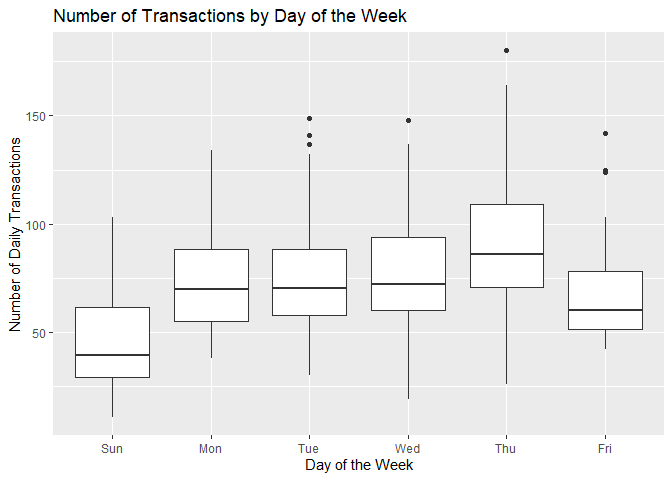

E-commerce Data Transaction Analysis
================

By analysing customer purchase and product sales history, we can group
products and customers into groups that behave similarly, and make
data-driven business decisions that can improve a wide range of
inventory and sales key performance indicators

You can find the dataset from
<https://www.kaggle.com/carrie1/ecommerce-data/data#data.csv>

Content “This is a transnational data set which contains all the
transactions occurring between 01/12/2010 and 09/12/2011 for a UK-based
and registered non-store online retail.The company mainly sells unique
all-occasion gifts. Many customers of the company are wholesalers.”

``` r
library(readr)
library(dplyr)
```

    ## 
    ## Attaching package: 'dplyr'

    ## The following objects are masked from 'package:stats':
    ## 
    ##     filter, lag

    ## The following objects are masked from 'package:base':
    ## 
    ##     intersect, setdiff, setequal, union

``` r
library(ggplot2)
library(DataExplorer)
```

    ## Warning: package 'DataExplorer' was built under R version 3.6.3

``` r
custData <- read_csv("data.csv")
```

    ## Parsed with column specification:
    ## cols(
    ##   InvoiceNo = col_character(),
    ##   StockCode = col_character(),
    ##   Description = col_character(),
    ##   Quantity = col_double(),
    ##   InvoiceDate = col_character(),
    ##   UnitPrice = col_double(),
    ##   CustomerID = col_double(),
    ##   Country = col_character()
    ## )

``` r
glimpse(custData)
```

    ## Observations: 541,909
    ## Variables: 8
    ## $ InvoiceNo   <chr> "536365", "536365", "536365", "536365", "536365", ...
    ## $ StockCode   <chr> "85123A", "71053", "84406B", "84029G", "84029E", "...
    ## $ Description <chr> "WHITE HANGING HEART T-LIGHT HOLDER", "WHITE METAL...
    ## $ Quantity    <dbl> 6, 6, 8, 6, 6, 2, 6, 6, 6, 32, 6, 6, 8, 6, 6, 3, 2...
    ## $ InvoiceDate <chr> "12/1/2010 8:26", "12/1/2010 8:26", "12/1/2010 8:2...
    ## $ UnitPrice   <dbl> 2.55, 3.39, 2.75, 3.39, 3.39, 7.65, 4.25, 1.85, 1....
    ## $ CustomerID  <dbl> 17850, 17850, 17850, 17850, 17850, 17850, 17850, 1...
    ## $ Country     <chr> "United Kingdom", "United Kingdom", "United Kingdo...

We have 8 variables. 5 double type + 3 character type

``` r
dim(custData)
```

    ## [1] 541909      8

We have 541909 rows.

## Missing value detection

## Inspecting data structure by using “VIM Library”

``` r
library(VIM)     
```

    ## Loading required package: colorspace

    ## Loading required package: grid

    ## Loading required package: data.table

    ## Warning: package 'data.table' was built under R version 3.6.3

    ## 
    ## Attaching package: 'data.table'

    ## The following objects are masked from 'package:dplyr':
    ## 
    ##     between, first, last

    ## VIM is ready to use. 
    ##  Since version 4.0.0 the GUI is in its own package VIMGUI.
    ## 
    ##           Please use the package to use the new (and old) GUI.

    ## Suggestions and bug-reports can be submitted at: https://github.com/alexkowa/VIM/issues

    ## 
    ## Attaching package: 'VIM'

    ## The following object is masked from 'package:datasets':
    ## 
    ##     sleep

``` r
aggr_plot <- aggr(custData, col=c('navyblue','red'), 
                  numbers = TRUE, 
                  sortVars = TRUE, 
                  labels = names(custData), 
                  cex.axis=.7, 
                  gap=3, 
                  ylab=c("Percentage of missing values",
                         "Structure of missing values"))
```

<!-- -->

    ## 
    ##  Variables sorted by number of missings: 
    ##     Variable       Count
    ##   CustomerID 0.249266943
    ##  Description 0.002683107
    ##    InvoiceNo 0.000000000
    ##    StockCode 0.000000000
    ##     Quantity 0.000000000
    ##  InvoiceDate 0.000000000
    ##    UnitPrice 0.000000000
    ##      Country 0.000000000

``` r
aggr_plot
```

    ## 
    ##  Missings in variables:
    ##     Variable  Count
    ##  Description   1454
    ##   CustomerID 135080

``` r
sapply(custData, function(x)(sum(is.na(x))))  # prints number of missing values
```

    ##   InvoiceNo   StockCode Description    Quantity InvoiceDate   UnitPrice 
    ##           0           0        1454           0           0           0 
    ##  CustomerID     Country 
    ##      135080           0

We have 1454 missing values at Description column. This is not a big
percentage.

``` r
# PERCENTAGE OF MISSING VALUES FOR EACH VARIABLE 
library(funModeling)
```

    ## Loading required package: Hmisc

    ## Loading required package: lattice

    ## Loading required package: survival

    ## Loading required package: Formula

    ## 
    ## Attaching package: 'Hmisc'

    ## The following objects are masked from 'package:dplyr':
    ## 
    ##     src, summarize

    ## The following objects are masked from 'package:base':
    ## 
    ##     format.pval, units

    ## funModeling v.1.9.3 :)
    ## Examples and tutorials at livebook.datascienceheroes.com
    ##  / Now in Spanish: librovivodecienciadedatos.ai

``` r
df_status(custData)
```

    ##      variable q_zeros p_zeros   q_na  p_na q_inf p_inf      type unique
    ## 1   InvoiceNo       0    0.00      0  0.00     0     0 character  25900
    ## 2   StockCode       0    0.00      0  0.00     0     0 character   4070
    ## 3 Description       0    0.00   1454  0.27     0     0 character   4211
    ## 4    Quantity       0    0.00      0  0.00     0     0   numeric    722
    ## 5 InvoiceDate       0    0.00      0  0.00     0     0 character  23260
    ## 6   UnitPrice    2515    0.46      0  0.00     0     0   numeric   1630
    ## 7  CustomerID       0    0.00 135080 24.93     0     0   numeric   4372
    ## 8     Country       0    0.00      0  0.00     0     0 character     38

We have 1454 NA values at the Description column. We have 2515 Zero
values at the Unitprice column.

``` r
options(repr.plot.width=8, repr.plot.height=3)
# look for missing values using the DataExplorer package
plot_missing(custData)
```

<!-- -->

Looking at the size of the dataset and the missing value plot, it seems
as if we can remove the missing values and still have a good-sized set
of data to work on.

``` r
custData <- na.omit(custData)
dim(custData)
```

    ## [1] 406829      8

Okay, so we’ve still got over 406829 rows of data to work with. One
thing that pops out is the InvoiceDate variable. This is a character
variable, but we can pull out the data and time information to create
two new variables: date and time. We’ll also create separate variables
for month, year and hour of day.

# Dealing with date and time

``` r
# separate date and time components of invoice date
custData$date <- sapply(custData$InvoiceDate, FUN = function(x) {strsplit(x, split = '[ ]')[[1]][1]})
custData$time <- sapply(custData$InvoiceDate, FUN = function(x) {strsplit(x, split = '[ ]')[[1]][2]})
custData
```

    ## # A tibble: 406,829 x 10
    ##    InvoiceNo StockCode Description Quantity InvoiceDate UnitPrice
    ##    <chr>     <chr>     <chr>          <dbl> <chr>           <dbl>
    ##  1 536365    85123A    WHITE HANG~        6 12/1/2010 ~      2.55
    ##  2 536365    71053     WHITE META~        6 12/1/2010 ~      3.39
    ##  3 536365    84406B    CREAM CUPI~        8 12/1/2010 ~      2.75
    ##  4 536365    84029G    KNITTED UN~        6 12/1/2010 ~      3.39
    ##  5 536365    84029E    RED WOOLLY~        6 12/1/2010 ~      3.39
    ##  6 536365    22752     SET 7 BABU~        2 12/1/2010 ~      7.65
    ##  7 536365    21730     GLASS STAR~        6 12/1/2010 ~      4.25
    ##  8 536366    22633     HAND WARME~        6 12/1/2010 ~      1.85
    ##  9 536366    22632     HAND WARME~        6 12/1/2010 ~      1.85
    ## 10 536367    84879     ASSORTED C~       32 12/1/2010 ~      1.69
    ## # ... with 406,819 more rows, and 4 more variables: CustomerID <dbl>,
    ## #   Country <chr>, date <chr>, time <chr>

Now, we have two new variables. ‘Date’ and ‘Time’

``` r
# create month, year and hour of day variables
custData$month <- sapply(custData$date, FUN = function(x) {strsplit(x, split = '[/]')[[1]][1]})
custData$year <- sapply(custData$date, FUN = function(x) {strsplit(x, split = '[/]')[[1]][3]})
custData$hourOfDay <- sapply(custData$time, FUN = function(x) {strsplit(x, split = '[:]')[[1]][1]})
custData
```

    ## # A tibble: 406,829 x 13
    ##    InvoiceNo StockCode Description Quantity InvoiceDate UnitPrice
    ##    <chr>     <chr>     <chr>          <dbl> <chr>           <dbl>
    ##  1 536365    85123A    WHITE HANG~        6 12/1/2010 ~      2.55
    ##  2 536365    71053     WHITE META~        6 12/1/2010 ~      3.39
    ##  3 536365    84406B    CREAM CUPI~        8 12/1/2010 ~      2.75
    ##  4 536365    84029G    KNITTED UN~        6 12/1/2010 ~      3.39
    ##  5 536365    84029E    RED WOOLLY~        6 12/1/2010 ~      3.39
    ##  6 536365    22752     SET 7 BABU~        2 12/1/2010 ~      7.65
    ##  7 536365    21730     GLASS STAR~        6 12/1/2010 ~      4.25
    ##  8 536366    22633     HAND WARME~        6 12/1/2010 ~      1.85
    ##  9 536366    22632     HAND WARME~        6 12/1/2010 ~      1.85
    ## 10 536367    84879     ASSORTED C~       32 12/1/2010 ~      1.69
    ## # ... with 406,819 more rows, and 7 more variables: CustomerID <dbl>,
    ## #   Country <chr>, date <chr>, time <chr>, month <chr>, year <chr>,
    ## #   hourOfDay <chr>

Now, we have 3 more new variables. ‘month’, ‘year’ and ‘HourOfDay’

``` r
head(custData, n =5)
```

    ## # A tibble: 5 x 13
    ##   InvoiceNo StockCode Description Quantity InvoiceDate UnitPrice CustomerID
    ##   <chr>     <chr>     <chr>          <dbl> <chr>           <dbl>      <dbl>
    ## 1 536365    85123A    WHITE HANG~        6 12/1/2010 ~      2.55      17850
    ## 2 536365    71053     WHITE META~        6 12/1/2010 ~      3.39      17850
    ## 3 536365    84406B    CREAM CUPI~        8 12/1/2010 ~      2.75      17850
    ## 4 536365    84029G    KNITTED UN~        6 12/1/2010 ~      3.39      17850
    ## 5 536365    84029E    RED WOOLLY~        6 12/1/2010 ~      3.39      17850
    ## # ... with 6 more variables: Country <chr>, date <chr>, time <chr>,
    ## #   month <chr>, year <chr>, hourOfDay <chr>

Okay, that’s pulled out some more useful components from our invoice
date column. Date variable’s class is still character. So let’s convert
the date variable to the date class so we can do a bit more with it:

``` r
custData$date <- as.Date(custData$date, "%m/%d/%Y")
```

Now that we have converted the date variable to a date class, we can
create a new variable that tells us the day of the week, using the wday
function from the lubridate package.

``` r
library(lubridate)
```

    ## 
    ## Attaching package: 'lubridate'

    ## The following objects are masked from 'package:data.table':
    ## 
    ##     hour, isoweek, mday, minute, month, quarter, second, wday,
    ##     week, yday, year

    ## The following object is masked from 'package:base':
    ## 
    ##     date

``` r
custData$dayOfWeek <- wday(custData$date, label=TRUE)
```

And we’ll just add one more column at this stage, we’ll calculate the
line total by multiplying the Quantity by the UnitPrice for each line:

``` r
custData <- custData %>% mutate(lineTotal = Quantity * UnitPrice)
head(custData)
```

    ## # A tibble: 6 x 15
    ##   InvoiceNo StockCode Description Quantity InvoiceDate UnitPrice CustomerID
    ##   <chr>     <chr>     <chr>          <dbl> <chr>           <dbl>      <dbl>
    ## 1 536365    85123A    WHITE HANG~        6 12/1/2010 ~      2.55      17850
    ## 2 536365    71053     WHITE META~        6 12/1/2010 ~      3.39      17850
    ## 3 536365    84406B    CREAM CUPI~        8 12/1/2010 ~      2.75      17850
    ## 4 536365    84029G    KNITTED UN~        6 12/1/2010 ~      3.39      17850
    ## 5 536365    84029E    RED WOOLLY~        6 12/1/2010 ~      3.39      17850
    ## 6 536365    22752     SET 7 BABU~        2 12/1/2010 ~      7.65      17850
    ## # ... with 8 more variables: Country <chr>, date <date>, time <chr>,
    ## #   month <chr>, year <chr>, hourOfDay <chr>, dayOfWeek <ord>,
    ## #   lineTotal <dbl>

That’s given us a good dataframe to start performing some summary
analyses. But before we move on to getting involved with product and
customer segmentation, we’ll look at some of the bigger features of the
dataset.

``` r
str(custData)
```

    ## Classes 'tbl_df', 'tbl' and 'data.frame':    406829 obs. of  15 variables:
    ##  $ InvoiceNo  : chr  "536365" "536365" "536365" "536365" ...
    ##  $ StockCode  : chr  "85123A" "71053" "84406B" "84029G" ...
    ##  $ Description: chr  "WHITE HANGING HEART T-LIGHT HOLDER" "WHITE METAL LANTERN" "CREAM CUPID HEARTS COAT HANGER" "KNITTED UNION FLAG HOT WATER BOTTLE" ...
    ##  $ Quantity   : num  6 6 8 6 6 2 6 6 6 32 ...
    ##  $ InvoiceDate: chr  "12/1/2010 8:26" "12/1/2010 8:26" "12/1/2010 8:26" "12/1/2010 8:26" ...
    ##  $ UnitPrice  : num  2.55 3.39 2.75 3.39 3.39 7.65 4.25 1.85 1.85 1.69 ...
    ##  $ CustomerID : num  17850 17850 17850 17850 17850 ...
    ##  $ Country    : chr  "United Kingdom" "United Kingdom" "United Kingdom" "United Kingdom" ...
    ##  $ date       : Date, format: "2010-12-01" "2010-12-01" ...
    ##  $ time       : chr  "8:26" "8:26" "8:26" "8:26" ...
    ##  $ month      : chr  "12" "12" "12" "12" ...
    ##  $ year       : chr  "2010" "2010" "2010" "2010" ...
    ##  $ hourOfDay  : chr  "8" "8" "8" "8" ...
    ##  $ dayOfWeek  : Ord.factor w/ 7 levels "Sun"<"Mon"<"Tue"<..: 4 4 4 4 4 4 4 4 4 4 ...
    ##  $ lineTotal  : num  15.3 20.3 22 20.3 20.3 ...

First, we’ll convert character variables into factors:

``` r
custData$Country <- as.factor(custData$Country)
custData$month <- as.factor(custData$month)
custData$year <- as.factor(custData$year)
levels(custData$year) <- c(2010,2011)
custData$hourOfDay <- as.factor(custData$hourOfDay)
custData$dayOfWeek <- as.factor(custData$dayOfWeek)
```

That done, we can take a look at some of the ‘big picture’ aspects of
the dataset.

``` r
options(repr.plot.width=8, repr.plot.height=3)
custData %>%
  group_by(date) %>%
  summarise(revenue = sum(lineTotal)) %>%
  ggplot(aes(x = date, y = revenue)) + geom_line() + geom_smooth(method = 'auto', se = FALSE) + labs(x = 'Date', y = 'Revenue (£)', title = 'Revenue by Date')
```

    ## `geom_smooth()` using method = 'loess' and formula 'y ~ x'

<!-- -->

It appears as though sales are trending up, so that’s a good sign, but
that doesn’t really generate any actionable insight, so let’s dive into
the data a bit farther…

## Day of week analysis

Using the lubridate package, we assigned a day of the week to each date
in our dataset.Are people more likely to spend as the week goes on?
Browsing to pass a Sunday afternoon? Procrastinating on that Friday
afternoon at work? Cheering yourself up after a difficult Monday?

Let’s dive into the days of the week side of our data and see what we
can uncover…

``` r
custData %>%
  group_by(dayOfWeek) %>%
  summarise(revenue = sum(lineTotal)) %>%
  ggplot(aes(x = dayOfWeek, y = revenue)) + geom_col() + labs(x = 'Day of Week', y = 'Revenue (£)', title = 'Revenue by Day of Week')
```

<!-- -->

It looks like there could be something interesting going on with the
amount of revenue that is generated on each particular weekday. Let’s
drill into this a little bit more by creating a new dataframe that we
can use to look at what’s going on at the day of the week level in a bit
more detail:

``` r
weekdaySummary <- custData %>%
  group_by(date, dayOfWeek) %>%
  summarise(revenue = sum(lineTotal), transactions = n_distinct(InvoiceNo)) %>%
  mutate(aveOrdVal = (round((revenue / transactions),2))) %>%
  ungroup()

head(weekdaySummary, n = 10)
```

    ## # A tibble: 10 x 5
    ##    date       dayOfWeek revenue transactions aveOrdVal
    ##    <date>     <ord>       <dbl>        <int>     <dbl>
    ##  1 2010-12-01 Wed        46051.          127      363.
    ##  2 2010-12-02 Thu        45775.          160      286.
    ##  3 2010-12-03 Fri        22598.           64      353.
    ##  4 2010-12-05 Sun        31381.           94      334.
    ##  5 2010-12-06 Mon        30465.          111      274.
    ##  6 2010-12-07 Tue        53126.           79      672.
    ##  7 2010-12-08 Wed        38049.          134      284.
    ##  8 2010-12-09 Thu        37178.          132      282.
    ##  9 2010-12-10 Fri        32005.           78      410.
    ## 10 2010-12-12 Sun        17218.           50      344.

Now we have our dataset that summarises what is happening on each day,
with our day of the week present and a couple of newly engineered
variables, daily transactions and average order value, we can drill into
our data a bit more thoroughly.

``` r
ggplot(weekdaySummary, aes(x = dayOfWeek, y = revenue)) + geom_boxplot() + labs(x = 'Day of the Week', y = 'Revenue', title = 'Revenue by Day of the Week')
```

<!-- -->

``` r
ggplot(weekdaySummary, aes(x = dayOfWeek, y = transactions)) + geom_boxplot() + labs(x = 'Day of the Week', y = 'Number of Daily Transactions', title = 'Number of Transactions by Day of the Week')
```

<!-- -->

``` r
ggplot(weekdaySummary, aes(x = dayOfWeek, y = aveOrdVal)) + geom_boxplot() + labs(x = 'Day of the Week', y = 'Average Order Value', title = 'Average Order Value by Day of the Week')
```

<!-- -->

Eye-balling the figures, it looks as though there are differences in the
amount of revenue on each day of the week, and that this difference is
driven by a difference in the number of transactions, rather than the
average order value. Let’s plot the data as a density plot to get a
better feel for how these data are distributed.

``` r
ggplot(weekdaySummary, aes(transactions, fill = dayOfWeek)) + geom_density(alpha = 0.2)
```

<!-- -->

There appears to be a reasonable amount of skewness in our
distributions, so we’ll use a non-parametric test to look for
statistically significant differences in our data.

``` r
kruskal.test(transactions ~ dayOfWeek, data = weekdaySummary)
```

    ## 
    ##  Kruskal-Wallis rank sum test
    ## 
    ## data:  transactions by dayOfWeek
    ## Kruskal-Wallis chi-squared = 71.744, df = 5, p-value = 4.441e-14

Looks like a significant difference there, that’s quite a p-value we’ve
got. Using the kruskal function from the agricolae package, we can look
to see which days are significantly different from the others:

``` r
library(agricolae)
```

    ## Warning: package 'agricolae' was built under R version 3.6.3

``` r
kruskal(weekdaySummary$transactions, weekdaySummary$dayOfWeek, console = TRUE)
```

    ## 
    ## Study: weekdaySummary$transactions ~ weekdaySummary$dayOfWeek
    ## Kruskal-Wallis test's
    ## Ties or no Ties
    ## 
    ## Critical Value: 71.7443
    ## Degrees of freedom: 5
    ## Pvalue Chisq  : 4.440892e-14 
    ## 
    ## weekdaySummary$dayOfWeek,  means of the ranks
    ## 
    ##     weekdaySummary.transactions  r
    ## Fri                    135.0100 50
    ## Mon                    162.4574 47
    ## Sun                     72.3600 50
    ## Thu                    213.5000 53
    ## Tue                    160.0769 52
    ## Wed                    170.2170 53
    ## 
    ## Post Hoc Analysis
    ## 
    ## t-Student: 1.96793
    ## Alpha    : 0.05
    ## Groups according to probability of treatment differences and alpha level.
    ## 
    ## Treatments with the same letter are not significantly different.
    ## 
    ##     weekdaySummary$transactions groups
    ## Thu                    213.5000      a
    ## Wed                    170.2170      b
    ## Mon                    162.4574     bc
    ## Tue                    160.0769     bc
    ## Fri                    135.0100      c
    ## Sun                     72.3600      d

## Conclusions from our day-of-the-week summary

By looking at our data at the level of weekday, we can see that there
are statistically significant differences in the number of transactions
that take place on different days of the week, with Sunday having the
lowest number of transactions, and Thursday the highest. As the average
order value remains relatively consistent, this translates to
differences in revenue.

Given the low number of transactions on a Sunday and a high number on a
Thursday, we could make recommendations around our digital advertising
spend. Should we spend less on a Sunday and more on a Thursday, given
that we know we already have more transactions, which could suggest
people are more ready to buy on Thursdays? Possible, but without knowing
other key metrics, it might be a bit hasty to say.

While this data does reveal insight, in order to be truly actionable, we
would want to combine this with more information. In particular,
combining these data with web analytics data would be hugely valuable.
How do these data correlate with web traffic figures? Does the
conversion rate change or is there just more traffic on a Thursday and
less on a Sunday?

What about out current advertising spend? Is the company already
spending less on a Sunday and more on a Thursday and that is behind our
observed differences? What about buying cycles? How long does it take
for a customer to go from thinking about buying something to buying it?
If it’s usually a couple of days, should we advertise more on a Tuesday?
Should we continue with an increased spend on a Thursday, when they’re
ready to buy, and let our competitors pay for the clicks while the
customer is in the ‘research’ stage of the process?

These types of questions illustrate the importance of understanding the
vertical, the business model and other factors and decisions which
underpin the dataset, rather than just looking at the dataset in
isolation.

# Hour of day analysis

In a similar way to our day-of-the-week analysis, is there insight to be
had from looking at the hours of the day?

``` r
custData %>%
  group_by(hourOfDay) %>%
  summarise(revenue = sum(lineTotal)) %>%
  ggplot(aes(x = hourOfDay, y = revenue)) + geom_col() + labs(x = 'Hour Of Day', y = 'Revenue (£)', title = 'Revenue by Hour Of Day')
```

<!-- -->

``` r
custData %>%
  group_by(hourOfDay) %>%
  summarise(transactions = n_distinct(InvoiceNo)) %>%
  ggplot(aes(x = hourOfDay, y = transactions)) + geom_col() + labs(x = 'Hour Of Day', y = 'Number of Transactions', title = 'Transactions by Hour Of Day')
```

<!-- -->

It certainly seems as though there is something going on here. We have
more transactions and more revenue in the morning to mid-afternoon,
tailing of quickly towards the early evening. There are also some hours
missing, so that’s something else that would also need looking into. Are
there genuinely no transactions during these times, or is something else
at work?

As the type of analysis we would do here is similar to what we did with
the dayOfWeek, we’ll leave this for now, knowing that there is a daily
trend, and there is likely some actionable insight we could draw if we
had some more information.

# Country summary

Our e-commerce retailer ships to a number of countries around the world.
Let’s drill into the data from that perspective and see what we can find
out.

``` r
countrySummary <- custData %>%
  group_by(Country) %>%
  summarise(revenue = sum(lineTotal), transactions = n_distinct(InvoiceNo)) %>%
  mutate(aveOrdVal = (round((revenue / transactions),2))) %>%
  ungroup() %>%
  arrange(desc(revenue))

head(countrySummary, n = 10)
```

    ## # A tibble: 10 x 4
    ##    Country         revenue transactions aveOrdVal
    ##    <fct>             <dbl>        <int>     <dbl>
    ##  1 United Kingdom 6767873.        19857      341.
    ##  2 Netherlands     284662.          101     2818.
    ##  3 EIRE            250285.          319      785.
    ##  4 Germany         221698.          603      368.
    ##  5 France          196713.          458      430.
    ##  6 Australia       137077.           69     1987.
    ##  7 Switzerland      55739.           71      785.
    ##  8 Spain            54775.          105      522.
    ##  9 Belgium          40911.          119      344.
    ## 10 Sweden           36596.           46      796.

``` r
unique(countrySummary$Country)
```

    ##  [1] United Kingdom       Netherlands          EIRE                
    ##  [4] Germany              France               Australia           
    ##  [7] Switzerland          Spain                Belgium             
    ## [10] Sweden               Japan                Norway              
    ## [13] Portugal             Finland              Channel Islands     
    ## [16] Denmark              Italy                Cyprus              
    ## [19] Austria              Singapore            Poland              
    ## [22] Israel               Greece               Iceland             
    ## [25] Canada               Unspecified          Malta               
    ## [28] United Arab Emirates USA                  Lebanon             
    ## [31] Lithuania            European Community   Brazil              
    ## [34] RSA                  Czech Republic       Bahrain             
    ## [37] Saudi Arabia        
    ## 37 Levels: Australia Austria Bahrain Belgium Brazil ... USA

Plenty to see there, certainly. A lot of different countries
contributing a good amount of revenue. As it seems that refunds and/or
cancellations are present in the dataset as revenue with a negative
value (not shown in this notebook, but you can dive in yourself), we can
assume that the revenue figures here are net of refunds; something that
it is important to consider when shipping goods overseas. However,
additional information on the costs incurred dealing with these refunds
would allow us to make more appropriate recommendations.

Let’s begin by looking at the top five countries in terms of revenue
contribution. We’ll exclude the UK as we know that this is a UK
retailer, so improving UK performance will undoubtedly already be on the
radar. Looking at the top five non-UK by revenue, the lowest number of
transactions is 69 (Australia), which, given the time period of the
dataset, is still a regular number of transactions, so the inclusion of
these countries seems justified.

``` r
topFiveCountries <- custData %>%
  filter(Country == 'Netherlands' | Country == 'EIRE' | Country == 'Germany' | Country == 'France' | Country == 'Australia')
```

``` r
topFiveCountrySummary <- topFiveCountries %>%
  group_by(Country, date) %>%
  summarise(revenue = sum(lineTotal), transactions = n_distinct(InvoiceNo), customers = n_distinct(CustomerID)) %>%
  mutate(aveOrdVal = (round((revenue / transactions),2))) %>%
  ungroup() %>%
  arrange(desc(revenue))

head(topFiveCountrySummary)
```

    ## # A tibble: 6 x 6
    ##   Country     date       revenue transactions customers aveOrdVal
    ##   <fct>       <date>       <dbl>        <int>     <int>     <dbl>
    ## 1 Netherlands 2011-10-20  25834.            3         1     8611.
    ## 2 Australia   2011-06-15  23427.            2         1    11713.
    ## 3 Australia   2011-08-18  21880.            1         1    21880.
    ## 4 Netherlands 2011-08-11  19151.            1         1    19151.
    ## 5 Netherlands 2011-02-21  18279.            2         1     9140.
    ## 6 Netherlands 2011-03-29  18248.            2         1     9124.

``` r
ggplot(topFiveCountrySummary, aes(x = Country, y = revenue)) + geom_col() + labs(x = ' Country', y = 'Revenue (£)', title = 'Revenue by Country')
```

<!-- -->

``` r
ggplot(topFiveCountrySummary, aes(x = date, y = revenue, colour = Country)) + geom_smooth(method = 'auto', se = FALSE) + labs(x = ' Country', y = 'Revenue (£)', title = 'Revenue by Country over Time')
```

    ## `geom_smooth()` using method = 'loess' and formula 'y ~ x'

<!-- -->

``` r
ggplot(topFiveCountrySummary, aes(x = Country, y = aveOrdVal)) + geom_boxplot() + labs(x = ' Country', y = 'Average Order Value (£)', title = 'Average Order Value by Country') + scale_y_log10()
```

    ## Warning in self$trans$transform(x): NaNs produced

    ## Warning: Transformation introduced infinite values in continuous y-axis

    ## Warning: Removed 78 rows containing non-finite values (stat_boxplot).

<!-- -->

``` r
ggplot(topFiveCountrySummary, aes(x = Country, y = transactions)) + geom_boxplot() + labs(x = ' Country', y = 'Transactions', title = 'Number of Daily Transactions by Country')
```

<!-- -->

These simple analyses show that there are opportunities. Revenue in EIRE
seems to be driven by 3 customers, who buy regularly and have a good
average order value, but EIRE revenue has been declining recently. Given
the small number of customers and high revenue, a bespoke email or
promotion to these customers may drive loyalty and get them buying
again.

The Netherlands has also been a significant source of revenue, but
another which has been declining in the last few months of the dataset.
Further research into this (marketing campaign activity and web
analytics data) may provide further insight into why this may be the
case, but it does appear that, as customers in the Netherlands have
shown a willingness to purchase in the past, the country represents a
good opportunity to market to to continue to build a loyal customer
base.

France and Germany represent significant opportunities. Revenue from
these countries has been rising, and the number of daily transactions is
\[relatively\] strong. Marketing campaigns which aim to improve this
while increasing average transaction values may be of significant
benefit.

A somewhat major caveat… Just looking at the numbers, without any other
data from other sources at our disposal, something does look odd.
Perhaps we have a large proportion of B2B customers, or maybe there is
someting going on inside our dataset that we ned to spend more time
looking at…

# Customer segmentation

When it comes to marketing, being able to segment your customers so that
you can market appropriate products and offers to them is a quick win.
There is little point in sending a potential student who has been
browsing nursing courses on your university site an email espousing the
USPs of your fine arts courses.

In this dataset, we have the customer ID, which we can use to start
looking for differences between customers. While we have product IDs and
descriptions, we are lacking in a simple product category ID. There is
information we can extract from other fields, but that may be beyond the
scope of this kernel, which is already getting a little long\!

Let’s look at our customer data from the point of view of loyalty. If we
can identify a group of customers who shop regularly, we can target this
group with dedicated marketing campaigns which may reinforce their
loyalty, and perhaps lead to them becoming brand ambassodors on social
media.

``` r
custSummary <- custData %>%
  group_by(CustomerID) %>%
  summarise(revenue = sum(lineTotal), transactions = n_distinct(InvoiceNo)) %>%
  mutate(aveOrdVal = (round((revenue / transactions),2))) %>%
  ungroup() %>%
  arrange(desc(revenue))

head(custSummary, n = 10)
```

    ## # A tibble: 10 x 4
    ##    CustomerID revenue transactions aveOrdVal
    ##         <dbl>   <dbl>        <int>     <dbl>
    ##  1      14646 279489.           77     3630.
    ##  2      18102 256438.           62     4136.
    ##  3      17450 187482.           55     3409.
    ##  4      14911 132573.          248      535.
    ##  5      12415 123725.           26     4759.
    ##  6      14156 113384.           66     1718.
    ##  7      17511  88125.           46     1916.
    ##  8      16684  65892.           31     2126.
    ##  9      13694  62653.           60     1044.
    ## 10      15311  59419.          118      504.

``` r
ggplot(custSummary, aes(revenue)) + geom_histogram(binwidth = 10) + labs(x = 'Revenue', y = 'Count of Customers', title = 'Histogram of Revenue per customer')
```

<!-- -->

``` r
ggplot(custSummary, aes(revenue)) + geom_histogram() + scale_x_log10() + labs(x = 'Revenue', y = 'Count of Customers', title = 'Histogram of Revenue per customer (Log Scale)')
```

    ## Warning in self$trans$transform(x): NaNs produced

    ## Warning: Transformation introduced infinite values in continuous x-axis

    ## `stat_bin()` using `bins = 30`. Pick better value with `binwidth`.

    ## Warning: Removed 55 rows containing non-finite values (stat_bin).

<!-- -->

``` r
ggplot(custSummary, aes(transactions)) + geom_histogram() + scale_x_log10() + labs(x = 'Number of Transactions', y = 'Count of Customers', title = 'Histogram of Transactions per customer')
```

    ## `stat_bin()` using `bins = 30`. Pick better value with `binwidth`.

<!-- -->

``` r
custSummaryB <- custData %>%
  group_by(CustomerID, InvoiceNo) %>%
  summarise(revenue = sum(lineTotal), transactions = n_distinct(InvoiceNo)) %>%
  mutate(aveOrdVal = (round((revenue / transactions),2))) %>% ungroup() %>%
  arrange(revenue) %>%
  mutate(cumsum=cumsum(revenue))

head(custSummaryB, n =10)
```

    ## # A tibble: 10 x 6
    ##    CustomerID InvoiceNo  revenue transactions aveOrdVal   cumsum
    ##         <dbl> <chr>        <dbl>        <int>     <dbl>    <dbl>
    ##  1      16446 C581484   -168470.            1  -168470. -168470.
    ##  2      12346 C541433    -77184.            1   -77184. -245653.
    ##  3      15098 C556445    -38970             1   -38970  -284623.
    ##  4      15749 C550456    -22998.            1   -22998. -307622.
    ##  5      16029 C570556    -11817.            1   -11817. -319438.
    ##  6      12536 C573079     -8322.            1    -8322. -327760.
    ##  7      16029 C551685     -8143.            1    -8143. -335903.
    ##  8      16029 C551699     -6930             1    -6930  -342833.
    ##  9      12744 C571750     -6068.            1    -6068. -348901.
    ## 10      14911 C562375     -4345.            1    -4345. -353246.

Okay, looking at the invoice numbers ranked in this way, it does seem as
though we have a lot of refunds / returns at play in these data. Let’s
take a look at customer ID 16446…

``` r
custData %>% filter(CustomerID == 16446)
```

    ## # A tibble: 4 x 15
    ##   InvoiceNo StockCode Description Quantity InvoiceDate UnitPrice CustomerID
    ##   <chr>     <chr>     <chr>          <dbl> <chr>           <dbl>      <dbl>
    ## 1 553573    22980     PANTRY SCR~        1 5/18/2011 ~      1.65      16446
    ## 2 553573    22982     PANTRY PAS~        1 5/18/2011 ~      1.25      16446
    ## 3 581483    23843     PAPER CRAF~    80995 12/9/2011 ~      2.08      16446
    ## 4 C581484   23843     PAPER CRAF~   -80995 12/9/2011 ~      2.08      16446
    ## # ... with 8 more variables: Country <fct>, date <date>, time <chr>,
    ## #   month <fct>, year <fct>, hourOfDay <fct>, dayOfWeek <ord>,
    ## #   lineTotal <dbl>

It looks like, after buying a scrubbing brush and a pastry brush, this
customer returned seven months’ later, added 80,995 Paper Craft Little
Birdies to their cart and checked out with an order for £168,470. I
don’t know about you, but I think my card provider would get a bit
upset if I tried to make that sort of online purchase. The little
birdies were refunded 12 minutes later.

Looking at the rest of the cumulative data, it seems as though there are
quite a lot of high-quantity sales and refunds. Before continuing with
this analysis in a real-world situation, it would be advantagous to
speak with the e-commerce department to get some insight into the
business, the website and checkout design and the types of customers.
Are there a number of B2B customers who place very large orders for
example?

However, for the purposes of this kernel, we’ll accept that we are aware
of these transactions, and continue. It does look as though many of
these large transactions are refunded, so if we sum the revenue, we
should be working with some reasonable numbers.

``` r
custSummaryB <- custData %>%
  group_by(InvoiceNo, CustomerID, Country, date, month, year, hourOfDay, dayOfWeek) %>%
  summarise(orderVal = sum(lineTotal)) %>%
  mutate(recent = Sys.Date() - date) %>%
  ungroup()

custSummaryB$recent <- as.character(custSummaryB$recent)
custSummaryB$recentDays <- sapply(custSummaryB$recent, FUN = function(x) {strsplit(x, split = '[ ]')[[1]][1]})
custSummaryB$recentDays <- as.integer(custSummaryB$recentDays)

head(custSummaryB, n = 5)
```

    ## # A tibble: 5 x 11
    ##   InvoiceNo CustomerID Country date       month year  hourOfDay dayOfWeek
    ##   <chr>          <dbl> <fct>   <date>     <fct> <fct> <fct>     <ord>    
    ## 1 536365         17850 United~ 2010-12-01 12    2010  8         Wed      
    ## 2 536366         17850 United~ 2010-12-01 12    2010  8         Wed      
    ## 3 536367         13047 United~ 2010-12-01 12    2010  8         Wed      
    ## 4 536368         13047 United~ 2010-12-01 12    2010  8         Wed      
    ## 5 536369         13047 United~ 2010-12-01 12    2010  8         Wed      
    ## # ... with 3 more variables: orderVal <dbl>, recent <chr>,
    ## #   recentDays <int>

Now we have a nice dataframe to work with that gives us the order value
and date / time information for each transaction, that we can now group
by customer:

``` r
customerBreakdown <- custSummaryB %>%
  group_by(CustomerID, Country) %>%
  summarise(orders = n_distinct(InvoiceNo), revenue = sum(orderVal), meanRevenue = round(mean(orderVal),2), medianRevenue = median(orderVal), 
            mostDay = names(which.max(table(dayOfWeek))), mostHour = names(which.max(table(hourOfDay))),
           recency = min(recentDays))%>%
  ungroup()

head(customerBreakdown)
```

    ## # A tibble: 6 x 9
    ##   CustomerID Country orders revenue meanRevenue medianRevenue mostDay
    ##        <dbl> <fct>    <int>   <dbl>       <dbl>         <dbl> <chr>  
    ## 1      12346 United~      2      0           0             0  Tue    
    ## 2      12347 Iceland      7   4310         616.          585. Tue    
    ## 3      12348 Finland      4   1797.        449.          338. Tue    
    ## 4      12349 Italy        1   1758.       1758.         1758. Mon    
    ## 5      12350 Norway       1    334.        334.          334. Wed    
    ## 6      12352 Norway      11   1545.        140.          160. Tue    
    ## # ... with 2 more variables: mostHour <chr>, recency <int>

We’ve now got a dataframe that gives us a bit more information about
each customer. We’ll just filter that down a bit more…

``` r
custBreakSum <- customerBreakdown %>%
  filter(orders > 1, revenue > 50)

head(custBreakSum)
```

    ## # A tibble: 6 x 9
    ##   CustomerID Country orders revenue meanRevenue medianRevenue mostDay
    ##        <dbl> <fct>    <int>   <dbl>       <dbl>         <dbl> <chr>  
    ## 1      12347 Iceland      7   4310         616.          585. Tue    
    ## 2      12348 Finland      4   1797.        449.          338. Tue    
    ## 3      12352 Norway      11   1545.        140.          160. Tue    
    ## 4      12356 Portug~      3   2811.        937.          481. Tue    
    ## 5      12358 Austria      2   1168.        584.          584. Tue    
    ## 6      12359 Cyprus       6   6246.       1041.          828. Wed    
    ## # ... with 2 more variables: mostHour <chr>, recency <int>

``` r
dim(custBreakSum)
```

    ## [1] 3032    9

Okay, we’ve created a dataframe that gives us a list of repeat customers
and tells us their country, how many orders they have made, total
revenue and average order value as well as the day of the week and the
time of the day they most frequently place orders. From this, we’re in a
good position to answer a number of questions about our customers that
we could use to target specific marketing materials, promotions and
offers.

The data are a few years old now, so the recency column looks a bit
lapsed, but imagine that we’re actually in 2012\!

``` r
library(heatmaply)
```

    ## Warning: package 'heatmaply' was built under R version 3.6.3

    ## Loading required package: plotly

    ## 
    ## Attaching package: 'plotly'

    ## The following object is masked from 'package:Hmisc':
    ## 
    ##     subplot

    ## The following object is masked from 'package:ggplot2':
    ## 
    ##     last_plot

    ## The following object is masked from 'package:stats':
    ## 
    ##     filter

    ## The following object is masked from 'package:graphics':
    ## 
    ##     layout

    ## Loading required package: viridis

    ## Loading required package: viridisLite

    ## Registered S3 method overwritten by 'seriation':
    ##   method         from 
    ##   reorder.hclust gclus

    ## 
    ## ======================
    ## Welcome to heatmaply version 1.0.0
    ## 
    ## Type citation('heatmaply') for how to cite the package.
    ## Type ?heatmaply for the main documentation.
    ## 
    ## The github page is: https://github.com/talgalili/heatmaply/
    ## Please submit your suggestions and bug-reports at: https://github.com/talgalili/heatmaply/issues
    ## Or contact: <tal.galili@gmail.com>
    ## ======================

``` r
custMat <- custBreakSum %>%
  select(recency, revenue, meanRevenue, medianRevenue, orders) %>%
  as.matrix()

rownames(custMat) <- custBreakSum$CustomerID

head(custMat)
```

    ##       recency revenue meanRevenue medianRevenue orders
    ## 12347    3033 4310.00      615.71        584.91      7
    ## 12348    3106 1797.24      449.31        338.50      4
    ## 12352    3067 1545.41      140.49        160.33     11
    ## 12356    3053 2811.43      937.14        481.46      3
    ## 12358    3032 1168.06      584.03        584.03      2
    ## 12359    3038 6245.53     1040.92        828.41      6

``` r
options(repr.plot.width=7, repr.plot.height=6)
heatmap(scale(custMat), cexCol = 0.7)
```

<!-- -->

Looking at the heatmap, we can see that the total revenue clusters with
the number of orders as we would expect, that the mean and median order
values cluster together, again, as expected, and that the order recency
sits in its own group. However, the main point of interest here is how
the rows (customers) cluster.

By analysing the data in this way, we can uncover groups of customers
that behavve in similar ways. This level of customer segmentation is
useful in marketing to these groups of customers appropriately. A
marketing campaign that works for a group of customers that places low
value orders frequently may not be appropriate for customers who place
sporadic, high value orders for example.

# Summary and conclusions

This dataset offers myriad opportunities for practising skills in
e-commerce sales analysis and customer segmentation. There are some
other variables it would be nice to have in the dataset such as
categories for the products. Additionally, before performing analysis it
would be important to talk with the e-commerce team to understand the
business and its customers and its strategic and tactical objectives.
Knowing what the business wants to achieve, and what questions it has
are central to performing a relevant analysis that generates actionable
insight.

Of course, there is still a lot more that we can do with this dataset.
We haven’t looked at the frequency of purchases, and we’ve not looked at
the products. While a simple ‘product category’ variable would have been
very useful.

I will do RFM (recency, frequency, monetary) analysis in another mini
project.
